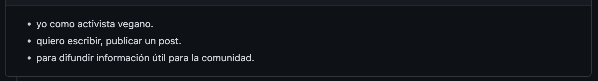

# VeganShip - Red Social

## Índice

[1.¿Qué es una Red Social?](#1-¿qué-es-una-red-social?)

[2.¿Qué es Veganship?](#2-¿qué-es-veganship?)

[3.Objetivo de Veganship](#3-objetivo-de-veganship)

[4.Principales Usuarios](#4-principales-usuarios)

[5.Historias de Usuarios](#5-historias-de-usuarios)

[6.Diseño de la Interfaz de Usuario](#6-diseño-de-la-interfaz-de-usuario)

***

## **1. ¿Qué es una Red Social?**

Es una estructura social formada por personas que comparten intereses similares y/o valores comunes. El principal propósito es el de conectar a personas.

Cuando hablamos de redes sociales, se nos vienen a la mente los sitios más usados, Facebook, Instagram, Twitter, TikTok, etc. Los cuales han tenido un gran impacto, social y virtual.
Además, se comenzó a analizar las necesidades de los usuarios, que deseaban conectar con personas de cualquier parte del mundo, empresas u organizaciones. Y que les permitiera compartir información e interactuar.

## **2. ¿Qué es Veganship?**

Somos una red social, pensada en las personas veganas para compartir datos relacionados con el veganismo. 

## **3. Objetivo de Veganship**

Nuestro principal objetivo, se basa en conectar a personas veganas o interesadas en el veganismo, para compartir información relevante, como recetas, datos de lugares(restaurantes), eventos, consejos de nutrición,etc.

## **4. Principales Usuarios**

Nuestro público objetivo y principales usuarios son:
* Personas veganas que llevan un estilo de vida en base a la alimentación vegana.
* Personas interesadas en insertarse en el mundo del veganismo.
* Personas vegetarianas.
 
 ## **5. Historias de Usuarios**

Desarrollamos las Historias de Usuario en base a las necesidades que pudimos observar y analizar de nuestro Público Objetivo.

### ***Historia de Usuario 1***

### ***Historia de Usuario 2***

### ***Historia de Usuario 3***

### ***Historia de Usuario 4***

### ***Historia de Usuario 5***

### ***Historia de Usuario 6***

### ***Historia de Usuario 7***

### ***Historia de Usuario 8***

## **6. Diseño de la Interfaz de Usuario**

### ***Prototipo de Baja Fidelidad***

### ***Prototipo de Alta Fidelidad***

### ***Prototipo Final Figma***
* [Prototipo Mobile Figma](https://www.figma.com/proto/c5574VMaGH6qSKo5ZCsE7W/Social-Network-Vegan?node-id=389%3A517&scaling=scale-down&page-id=38%3A2&starting-point-node-id=389%3A517)

